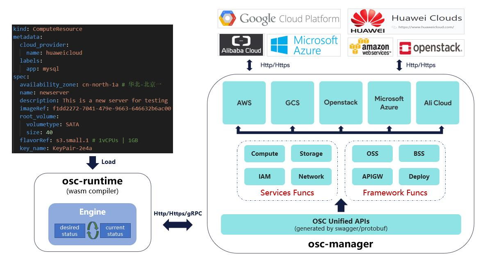
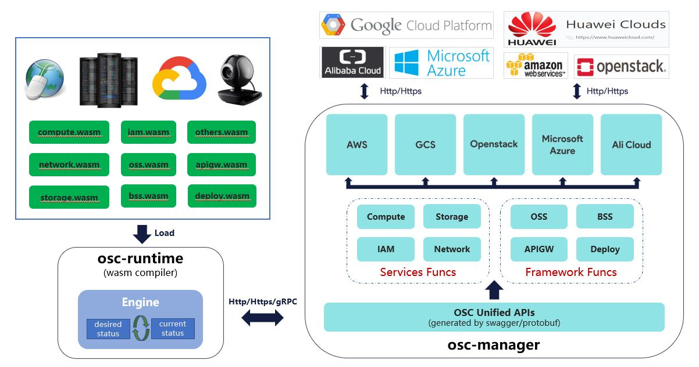

# osc-serverless

[](https://github.com/leonwanghui/osc-serverless/releases)
[](https://github.com/leonwanghui/osc-serverless/blob/master/LICENSE)

This is a prototype for osc design with serverless technology.

## Background

As we all know, public cloud is defacto standard to providing IT infrastructure service for end-users and enterprise customers, and moreover customers tend to build their business platforms on multiple cloud providers at the same time. Considering the widely adoption of public cloud, it's very tempting for those SaaS providers (such like SAP, Oracle, etc) which expect to sell their products as cloud services but without the capability to construct cloud infrastructure by themselves.

Open Service Cloud (OSC for short) project is formulated for public cloud providers as a standard to help SaaS providers build their own cloud services. In this way SaaS providers can achieve their goals by integrating the base of existing cloud infrastructures, which would be a win-win solution for both SaaS providers and public cloud providers.

## Architecture

High level architecture of the OSC prototype system:



In the short future, the architecture would eventually be designed as below:



## Project status

This project should be considered **experimental** at the very early stage, all rich features are under active development. Here is the current feature support matrix:

| Release or Feature | Introduced | AWS | Azure | GCP | Huaweicloud |
| ------------------ | ---------- | --- | ----- | --- | ----------- |
| Compute            | v0.0.2     | -   | -     | -   | ✔️          |
| Storage            | v0.0.2     | -   | -     | -   | ✔️          |
| Network            | v0.0.2     | -   | -     | -   | ✔️          |

## Deployment tutorial

Please notice that currently this project is only tested on Ubuntu system, so `Ubuntu 16.04+` should be prepared as the testing environment.

### Install system packages

```shell
sudo apt-get update && sudo apt-get install -y build-essential gcc cmake libssl-dev pkg-config
sudo apt-get install -y zip tree
```

### Install Golang (v1.12.1)

```shell
wget https://storage.googleapis.com/golang/go1.12.1.linux-amd64.tar.gz
tar -C /usr/local -zxvf go1.12.1.linux-amd64.tar.gz
echo 'export PATH=$PATH:/usr/local/go/bin' >> /etc/profile
echo 'export GOPATH=$HOME/gopath' >> /etc/profile
source /etc/profile
```

### Install Rust (latest version)

If you are running Windows, to install Rust, download and run the [RUST-INIT.EXE](https://win.rustup.rs/), and then follow the onscreen instructions.

If you are a Linux user, run the following in your terminal, then follow the on-screen instructions to install Rust.

```shell
curl https://sh.rustup.rs -sSf | sh
```

### Install npm and node.js (latest version)

```shell
sudo apt-get install -y npm
sudo npm install n -g
sudo n stable

# Check the version of npm and node
npm -v
node -v
```

### Install wasm-pack tool (for developers)

If you are running Windows 64-bit, download and run [wasm-pack-init.exe](https://github.com/rustwasm/wasm-pack/releases/download/v0.8.1/wasm-pack-init.exe) then follow the onscreen instructions.

If you're a Linux user run the following in your terminal, then follow the onscreen instructions to install `wasm-pack`:

```shell
curl https://rustwasm.github.io/wasm-pack/installer/init.sh -sSf | sh
```

### Configuration

* Cloud providers (take `Huaweicloud` for example)

Here is reference configuration of cloud backend (located in `osc-config/config_hwcloud.yaml`):

```yaml
identityEndpoint: https://iam.cn-north-1.myhuaweicloud.com
domain: myhuaweicloud.com
region: cn-north-1
projectID: 05203214f40025ad2f46c00469ce37b4 # cn-north-1
domainID: your domain id
accessKey: your AK string
secretKey: your SK string
```

* Resource request (such as compute service)

```yaml
kind: ComputeResource
metadata:
  cloud_provider:
    name: huaweicloud
  labels:
    app: etcd
spec:
  name: newserver
  description: This is a new server for testing
  availability_zone: cn-north-1a # 华北-北京一
  cloud_provider: # Deprecated, please use metadata
    name: huaweicloud
  cloud_server_request_fragment:
    imageRef: f1dd2272-7041-479e-9663-646632b6ac00 # Ubuntu 16.04 server 64bit
    root_volume:
      volumetype: SATA
      size: 40
    flavorRef: t6.small.1 # 1vCPUs | 1GB
    key_name: KeyPair-2e4a
    user_data: "/etc/osc-config/app_install_etcd.sh"
    vpcid: e86bd162-8136-4227-a076-825161c95d29 # vpc-default | 192.168.0.0/16
    nics:
      - subnet_id: ff5330b5-c6f2-4983-8ba1-3fc81fe816e9 # subnet-default | 192.168.0.1
        # ip_address: x.x.x.x
    publicip:
      # id: 501e1f51-b00c-4d88-a586-29948c43910b
      eip: # create a new public ip
        ip_type: 5_sbgp
        bandwidth:
          name: newbandwidth
          sharetype: PER
          size: 1
    security_groups:
      - id: 86bd6416-3d4b-45d3-bf6e-605b9326015a # Sys-default
    count: 1
```

After configure cloud backend and request parameters, please move these configuration files into `/etc/osc-config` folder:

```shell
cp -r osc-config/ /etc/
```

### Run service

```shell
# build the source code
cd osc-serverless/ && make
# run osc-manager service
./build/bin/osc-mgr

# run osc-runtime to create compute service
./build/bin/osc-rt -o create -f /etc/osc-config/osc_request_compute.yaml
# run osc-runtime to delete compute service
./build/bin/osc-rt -o delete -f /etc/osc-config/osc_request_compute.yaml
```

Or you can run osc-runtime-wasm script to manage the resource (`npm` and `node` REQUIRED):

```shell
cd osc-runtime-wasm/webpack && npm install
npm run build
npm run serve
```

Then open the browser and login to `http://{ your_host_ip }:8088` to access the demo.
